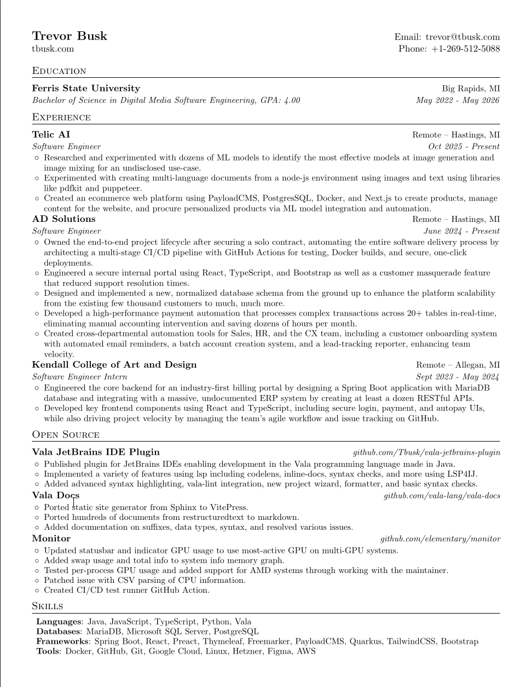

# LaTeX Software Engineer Resume

This is a resume template I created with my twist that is:

- Single-page
- One column
- Has modular components

This contains the following sections:

- Header
- Education
- Experience
- Open Source
- Projects (commented out)
- Skills
- Condensed Skills (commented out)

## Building the PDF

To build the PDF, you will need to install `texlive` and build using `latexmk`

You can build a PDF without keeping the extra output files using the following command:

```shell
latexmk -pdf Resume.tex && latexmk -c
```

This first will build the pdf and then clean up the extra files. 

## Preview




## Additional Resources

- [Latexmk Documentation](https://mgeier.github.io/latexmk.html)