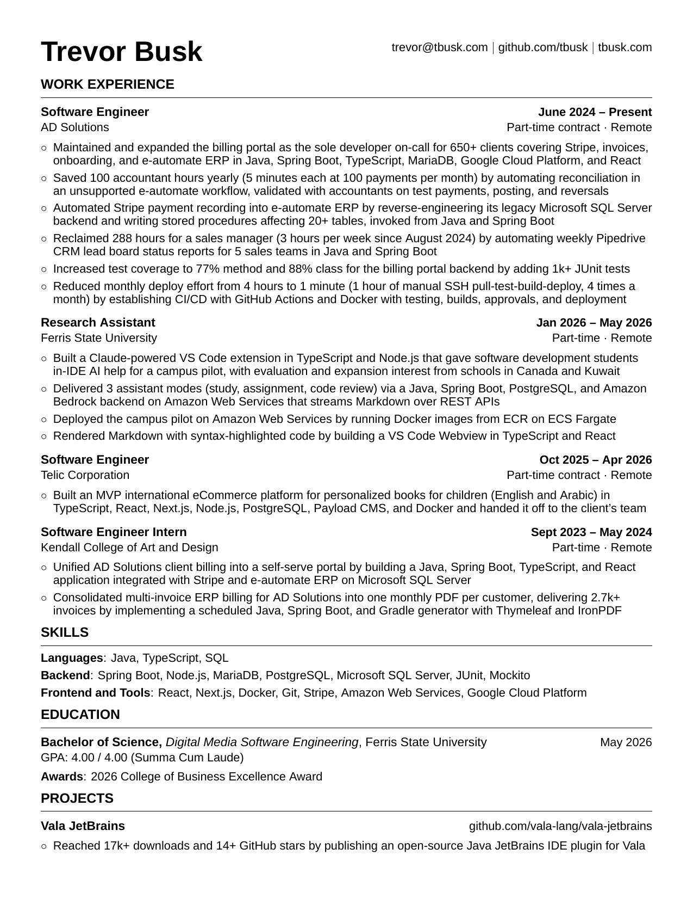

# LaTeX Software Engineer Resume

This is a resume template I created with my twist that is:

- Single-page
- One column
- Made up of modular components, of which the underlying details are abstracted

## Preview



## Getting Started

To get started, you can add things to the document starting between the begin and the end portions.

```latex
\begin{document}
    % anything you want
\end{document}
```

### Building

To build the PDF, you will need to install `texlive` and build using `latexmk`.

You likely will need to install dependencies, but on the Solus Linux Distribution, you only need `texlive` and
`latexmk`.

You can build a PDF without keeping the extra output files using the following command:

```shell
latexmk -xelatex Resume.tex && latexmk -c
```

This first half will build the pdf and the rest will clean up the extra files.

### Header

The header is the topmost item in the resume.

It contains:

1. Your name
2. Your email address
3. Your GitHub page
4. Your website

```latex
\rHeader
```

### Variables

The document uses variables to simplify some of the experience.

Your contact details and socials for the header and elsewhere:

- `\myName{}`: Your Full Name
- `\myEmailAddress{}`: Your email address
- `\myGitHubUrl{}`: Your GitHub profile URL
- `\myWebsite{}`: Your website URL

You can create new variables by adding them in the parameter section like this:

```latex
\def\myName{Trevor Busk}
```

and calling them like this:

```latex
\myName
```

### Sections

To declare a section, all you need to do is add a section with its title in a parameter.

I use this for section headers, such as `Skills`, `Work Experience`, `Projects`, and `Education`.

```latex
\section{SKILLS}
```

### Education Items

This section has five parameters:

1. Degree Type (e.g., Bachelor of Science, BSc, Associates, Masters)
2. Degree Name (e.g., Digital Media Software Engineering)
3. University Name (e.g., Ferris State University)
4. Date (e.g. May 2026)
5. GPA, standing, or whatever you want to highlight

Example:

```latex
\rEducationItem{Bachelor of Science}{Digital Media Software Engineering}{Ferris State University}{May 2026}{GPA: 4.00 / 4.00 (Summa Cum Laude)}
```

### Lists

Three types of lists are supported: bullet (filled circle), circle (unfilled circle), or empty (no circles).

#### Bullet

```latex
\rListBeginBullet

% any list items

\rListEndBullet
```

#### Circle

```latex
\rListBeginCircle

% any list items

\rListEndCircle
```

#### Empty

```latex
\rListBeginEmpty

% any list items

\rListEndEmpty

```

### Headings

Two types of headings are supported: general and project.

#### General

This has four parameters, which is a tabular layout of a bolded title on the top left, an item on the top right, an
item on the bottom left, and an italicized item on the bottom right.

```latex
\rGeneralHeading{Software Engineer}{June 2024 -- Present}{AD Solutions}{Part Time Contract -- Remote}
```

#### Project

This has two parameters:

1. Project Name (Bolded)
2. Link (Optional; right-aligned). Pass empty `{}` to omit.

```latex
\rProjectHeading{Problem Tracker}{github.com/tbusk/problem-tracker}
```

### List Items

#### Plain Item

This is the default item you want when you want to list something. It is just a regular list item.

This has one parameter for whatever text you want to show up in the list.

```latex
\rPlainItem{List item description}
```

#### Bolded Item with a description

This is used when you want to highlight something before you give a description, such as a project name, a skill, or a
tech stack item.

It has two parameters, one is a bolded title with a colon and a space appended to it, and the other is a description.

```latex
\rBoldedItemAndDescription{Languages}{Java, TypeScript, SQL}
```

### Links

You can add a link to something pretty easily

It has two parameters, the first is the full url, and the second is what the user actually sees.

```latex
\href{full url}{user-facing display}
```

### Spacing

You can add more spacing or adjust it for something pretty easily. Use either the hspace or vspace depending if you want
to add vertical or horizontal spacing.

#### Horizontal

```latex
\hspace{1pt}
```

#### Vertical

```latex
\vspace{1pt}
```

### Bolding

You can make something bold by using

```latex
\textbf{text}
```

### Italicization

You can make something italicized by using

```latex
\textit{text}
```

## Additional Resources

- [Latexmk Documentation](https://mgeier.github.io/latexmk.html)

## Inspiration

This was inspired by [sb2nov's LaTeX Resume](https://github.com/sb2nov/resume/) but has diverged significantly.

## License

This project is licensed under the [MIT License](https://opensource.org/licenses/MIT) found [here](LICENSE).
